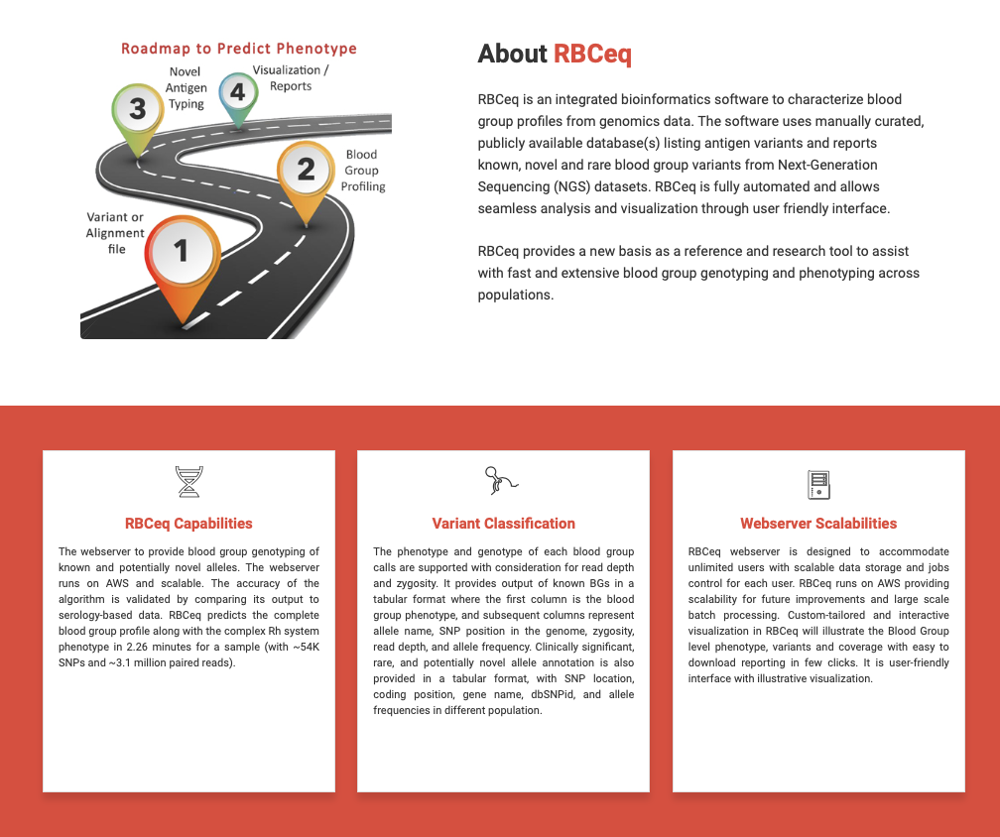

# BamTrimmer

It takes aligned BAM and output directory as an input.
First, it discards all the reads which are not aligned to blood group genes.
Then, it removes duplicate reads and generate the BAM index. 
Lastly, it calculates the overall coverage for blood group genes.

 

